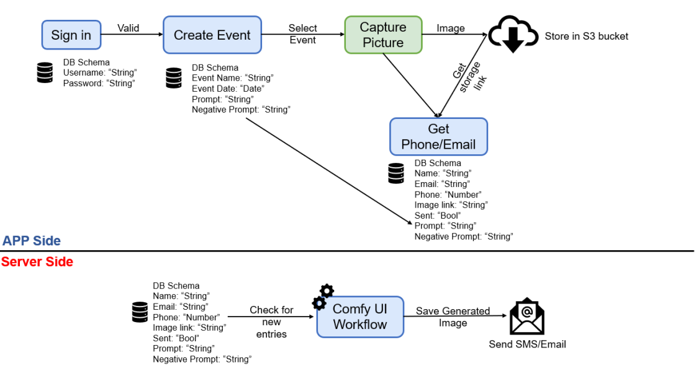

# AI Booth Project

## Flow of the App



## Technology Stack

### Frontend
- **React Native with Expo**: For building a cross-platform mobile application.

### Backend
- **MongoDB Atlas**: Used for storing information, offering 512 MB of free text data, sufficient for our needs.
- **Cloudinary**: Handles image storage and delivery. The free plan provides 25GB worth of monthly credits, which is ample for storage, image viewing bandwidth, etc.

## Setup Instructions

### Frontend Setup

Follow these steps to set up the React Native Expo app:

1. **Clone the Repository**
   ```bash
   git clone https://github.com/a2odysseylabs/LumetryAiPhotoBooth.git
   cd Frontend
   npm install
   ```

2. **Configure Environment Variables**
   Create a `.env` file in the `Frontend` folder with the following content:
   ```
   SERVER_LINK=''
   CLOUDINARY_CLOUD_NAME=''
   CLOUDINARY_UPLOAD_PRESET=''
   ```

3. **Start the App** (<code style="color : red">First checkout Cloudinary Setup and Backend Setup to finish filling the .env file first</code>)
   ```bash
   npm start
   ```

   You can now view the app on the web directly or use the Expo Go app to scan the QR code and view it on your mobile device.

4. **Local Mobile or Tablet Deployments**
   For local mobile or tablet deployments on iOS or Android, refer to the [Expo Local Deployment Guide](https://docs.expo.dev/guides/local-app-development/).

### Cloudinary Setup

1. Create an account at [Cloudinary](https://cloudinary.com/).
2. In the dashboard, locate your cloud name and update the `CLOUDINARY_CLOUD_NAME` field in the `.env` file.
3. Navigate to "Settings" > "Upload" in the dashboard.
4. Create a new upload preset:
   - Click "Add upload preset"
   - Set the mode to "Unsigned"
   - Copy the Name and update the `CLOUDINARY_UPLOAD_PRESET` in the `.env` file
   - Save the preset

### Backend Setup

1. Create a new repository for the backend code, e.g., [LumetryBackend](https://github.com/a2odysseylabs/LumetryBackend).

2. Use [Render](https://render.com/) for free hosting of the Express.js backend.

3. When deploying to Render, create a new `.env` file with:
   ```
   MONGO_URL=''
   ```

4. Obtain the MongoDB URL from [MongoDB Atlas](https://www.mongodb.com/products/platform/atlas-database) and add it to the `MONGO_URL` variable.

5. Set up the MongoDB database:
   - Inside your MongoDB Atlas cloud database, create a new database called `test`.
   - Within the `test` database, create a new collection called `UserInfo`.
   - Create one entry in the `UserInfo` collection with `username` and `password` fields. For example:
     ```json
     {
       "username": "admin",
       "password": "admin"
     }
     ```
   - Note: You can use any username and password combination you prefer. The app only includes a signin page, not a registration page, as end users won't have access to it. To update credentials in the future, modify them directly in the database.

6. Update the `SERVER_LINK` in the Frontend `.env` file with the Render deployment URL.

### Xcode Setup

1. from Frontend/ios run open aibooth.xcworkspace
2. make sure correct apple dev account is selected in Signing & Capabilities settings
3. plug in devices and select it as the target
4. click the run button to install on device
5. first time install the developer needs to be trusted on device. you will see a notification to trust. go to settings > general > VPN & Device Management select developer and click trust.
6. should be able to just open the app after trusting developer
